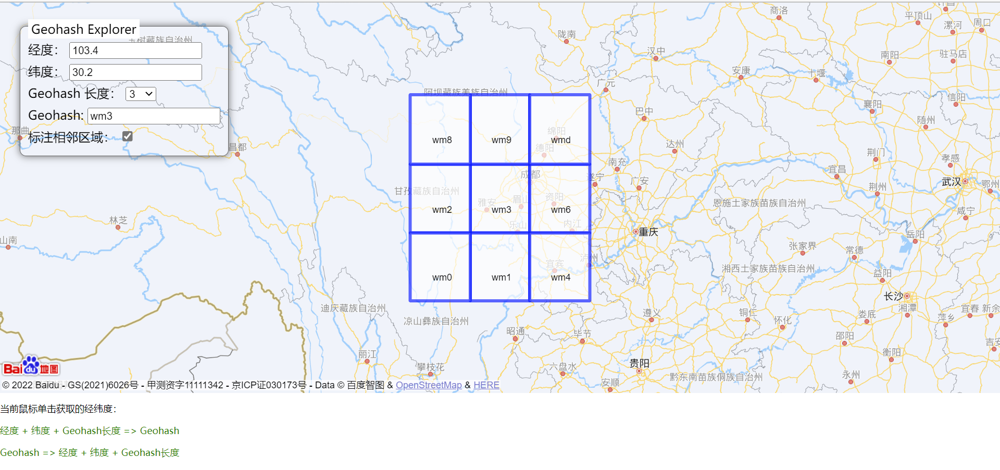

# BaiduMap Geohash Explorer

百度地图的 geohash 可视化工具，支持相邻区域显示，修改自 https://www.movable-type.co.uk/scripts/geohash.html，使用了 [latlon-geohash](https://github.com/chrisveness/latlon-geohash)。

## 使用方法

1. 注册百度账号，并获取用于 [JavaScript API 3.0](https://lbsyun.baidu.com/index.php?title=jspopular3.0) 的AK。
2. 将 `http://api.map.baidu.com/api?v=3.0&ak=xxxxxxxxx` 中的 `ak=xxxxxxxxx` 替换成你自己的 AK，例如 `ak=12345`。
3. 双击打开

## 特别感谢
* https://www.movable-type.co.uk/scripts/geohash.html
* [latlon-geohash](https://github.com/chrisveness/latlon-geohash)